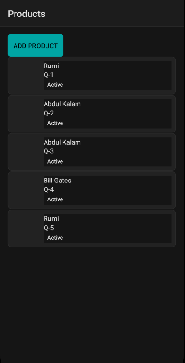
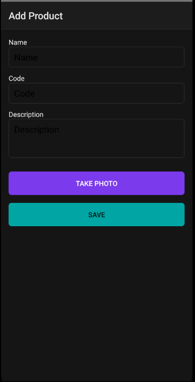
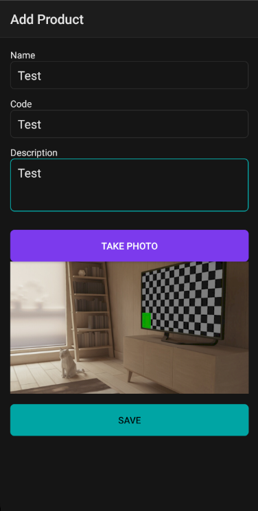
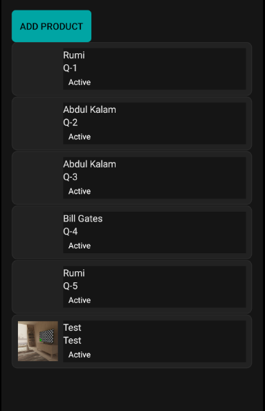
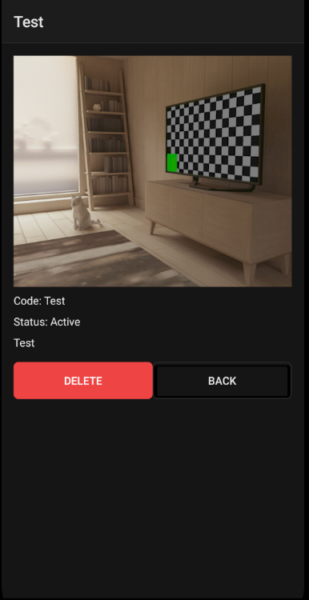

# NativeScript Scan Inventory
## Opis projektu
Aplikacja NativeScript + Angular do prostego inwentaryzowania.  
Cel: pobrać przykładowe dane z API, umożliwić dodawanie produktów z użyciem kamery oraz ich usuwanie.

## Co zaimplementowano
- Lista produktów: name, code, mini‑status  
- Szczegóły produktu: opis, zdjęcie (jeśli dodane), przycisk Usuń  
- Dodawanie produktu: pola Name, Code, Description + Take Photo (kamera)  
- Natywna funkcja: kamera (zapis zdjęcia lokalnie)  
- Integracja z API: pobranie próbek z https://dummyjson.com/quotes (limit 5)  
- Operacje lokalne: dodawanie i usuwanie produktów  
- Walidacja: pola Name i Code są wymagane  
- Ciemny motyw i style pól formularza

## Jak uruchomić (lokalnie)
1. Zainstaluj zależności:  
   `npm install`
2. Wyczyść i uruchom:  
   `ns clean`  
   `ns run android`  
3. Dodaj nową notatkę
4. Dodaj zdjęcie przez kamere
5. Sprawdż usuwanie notatek

## Struktura projektu (kluczowe pliki)
- `src/app/products/product.service.ts` — logika ładowania, dodawania, usuwania  
- `src/app/products/product-api.service.ts` — integracja z dummyjson quotes  
- `src/app/products/product-list.component.*` — lista i inicjalne ładowanie  
- `src/app/products/product-add.component.*` — formularz + kamera  
- `src/app/products/product-detail.component.*` — szczegóły + usuwanie  
- `src/app/app.css` — motyw ciemny i style formularzy

## Sekcja ze zrzutami ekranu

